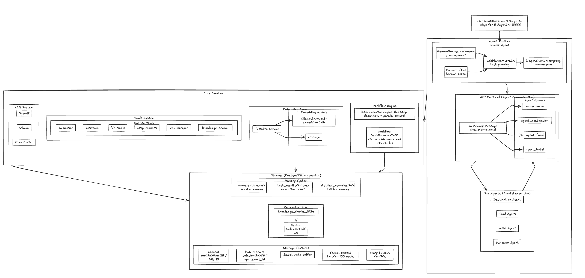
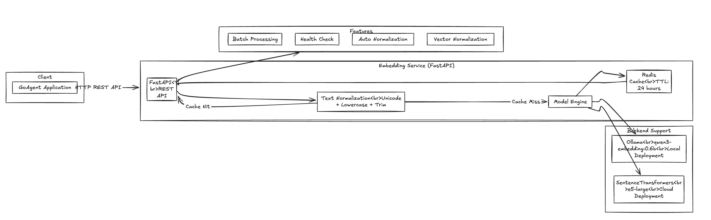
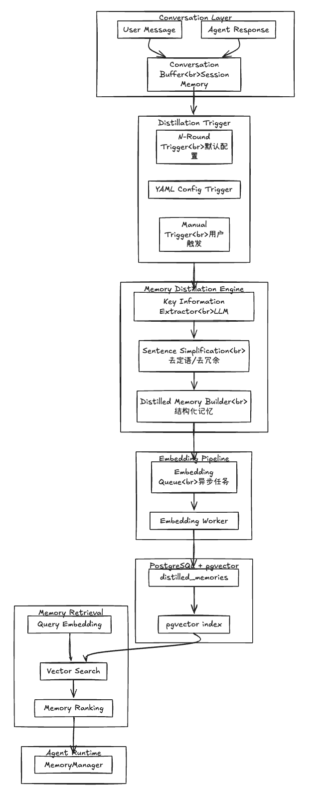

# GoAgent

GoAgent is a generic multi-agent framework implemented in Go, supporting multi-agent collaboration, memory management, and tool invocation.

## Architecture Diagram



### Embedding Gateway Service (FastAPI)


The Embedding Service is a standalone vector embedding service for GoAgent, supporting multiple backends:




**Embedding Service Features**:
- **High Performance**: Supports Ollama local deployment and SentenceTransformers cloud deployment
- **Smart Caching**: Redis cache + text normalization to avoid cache misses
- **Batch Processing**: Supports batch vector generation for improved efficiency
- **Auto Normalization**: Vectors automatically normalized to unit vectors for accurate cosine similarity
- **Health Check**: Built-in health check endpoint

**Configuration File**: `services/embedding/.env`
```env
BACKEND_TYPE=ollama              # Backend type: ollama / transformers
OLLAMA_BASE_URL=http://localhost:11434
OLLAMA_MODEL=qwen3-embedding:0.6b
MODEL_NAME=qwen3-embedding:0.6b
EMBEDDING_DIM=1024
REDIS_URL=redis://localhost:6379
CACHE_TTL=86400
HOST=0.0.0.0
PORT=8000
```

**Code Locations**: 
- `services/embedding/app.py` - Service main program
- `services/embedding/config.py` - Configuration management
- `internal/storage/postgres/embedding/client.go` - Go client


### Memory Distillation model




## Tech Stack

### Core Technologies
- **Language**: Go 1.21+
- **Database**: PostgreSQL 15+ with pgvector extension
- **Concurrency**: errgroup, sync
- **Protocol**: Custom AHP Protocol
- **Embedding Service**: FastAPI + Ollama/SentenceTransformers
- **Cache**: Redis

### Main Components
| Component | Purpose | Code Location |
|----------|---------|----------------|
| **Agent System** | Leader/Sub Agent collaboration | `internal/agents/` |
| **Protocol Layer** | Inter-agent communication and heartbeat | `internal/protocol/ahp/` |
| **Memory System** | Session, task, and distilled memory | `internal/memory/` |
| **Storage Layer** | PostgreSQL + pgvector | `internal/storage/postgres/` |
| **Tool System** | Tool registry and invocation | `internal/tools/` |
| **Workflow Engine** | DAG workflow orchestration | `internal/workflow/engine/` |
| **Embedding Service** | Vector embedding generation | `services/embedding/` |

### Dependencies
- `github.com/lib/pq` - PostgreSQL driver
- `github.com/google/uuid` - UUID generation
- `github.com/stretchr/testify` - Testing framework
- `golang.org/x/sync` - Concurrent extensions
- `gopkg.in/yaml.v3` - YAML parsing
- `fastapi` - Embedding service framework
- `redis` - Cache support

## Configuration

### 1. LLM Configuration

**Config File**: `examples/travel/config.yaml`

```yaml
llm:
  provider: openrouter        # LLM provider: openai / ollama / openrouter
  api_key: ""                  # API Key (recommended: use env var OPENROUTER_API_KEY)
  base_url: https://openrouter.ai/api/v1
  model: meta-llama/llama-3.1-8b-instruct
  timeout: 60                  # Request timeout (seconds)
  max_tokens: 2048              # Max response tokens
```

**Code Location**: `internal/llm/client.go:80-100`

### 2. Agent Configuration

```yaml
agents:
  leader:
    id: leader-travel
    max_steps: 10              # Max execution steps
    max_parallel_tasks: 4      # Max parallel tasks
    enable_cache: true          # Enable caching

  sub:
    - id: agent-destination
      type: destination         # Agent type: destination/food/hotel/itinerary
      triggers: [destination]   # Trigger keywords
      max_retries: 3             # Max retry attempts
      timeout: 30                # Timeout (seconds)
```

**Code Location**: `internal/agents/leader/agent.go:30-50`

### 3. Database Configuration

```yaml
storage:
  enabled: true               # Enable PostgreSQL storage
  type: postgres
  host: localhost
  port: 5433                # Docker default port is 5433
  user: postgres
  password: postgres
  database: goagent
  
  pgvector:
    enabled: true             # Enable pgvector
    dimension: 1024           # Vector dimension
```

**Code Location**: `internal/storage/postgres/pool.go:35-50`

### 4. Embedding Service Configuration

```yaml
embedding:
  service_url: http://localhost:8000    # Embedding service address
  model: qwen3-embedding:0.6b          # Model name
  dimension: 1024                       # Vector dimension
  timeout: 30                           # Request timeout (seconds)
```

**Code Location**: `internal/storage/postgres/embedding/client.go:30-50`

### 5. Memory Configuration

```yaml
memory:
  enabled: true               # Enable memory system
  enable_distillation: true   # Enable memory distillation
  distillation_threshold: 3   # Trigger distillation every N rounds
```

**Code Location**: `examples/knowledge-base/main.go:750-760`

### 6. Retrieval Configuration

```yaml
knowledge:
  chunk_size: 1000             # Document chunk size
  chunk_overlap: 100            # Chunk overlap
  top_k: 10                    # Return top K results
  min_score: 0.6               # Minimum similarity threshold
```

**Code Location**: `internal/storage/postgres/repositories/knowledge_repository.go:100-120`

## Quick Start

### 1. Set Environment

```bash
# Set API Key (recommended: use environment variable)
export OPENROUTER_API_KEY="your-api-key"

# Or set in config file (not recommended)
```

### 2. Start Database (Optional, for persistence)

```bash
# Quick start PostgreSQL + pgvector with Docker
docker run -d \
  --name goagent-db \
  -e POSTGRES_PASSWORD=postgres \
  -e POSTGRES_DB=goagent \
  -p 5433:5432 \
  pgvector/pgvector:pg15

# Verify connection
docker exec -it goagent-db psql -U postgres -d goagent -c "SELECT version();"
```

### 3. Start Embedding Service (for vector retrieval)

```bash
# Navigate to embedding service directory
cd services/embedding

# Run setup script (install dependencies and model)
./setup.sh

# Start service
./start.sh

# Verify service
curl http://localhost:8000/health
```

### 4. Run Examples

```bash
# Travel planning example
cd examples/travel
go run main.go

# Knowledge base Q&A example (requires database + embedding service)
cd examples/knowledge-base
go run main.go --save README.md  # Import document
go run main.go --chat             # Start Q&A
```

## Project Structure

```
goagent/
├── examples/               # Example applications
│   ├── travel/              # Travel planning
│   ├── knowledge-base/       # Knowledge base Q&A
│   └── simple/              # Simple example
├── internal/                # Core implementation
│   ├── agents/              # Agent system
│   │   ├── base/            # Agent base interfaces
│   │   ├── leader/          # Leader Agent
│   │   └── sub/             # Sub Agent
│   ├── protocol/             # AHP protocol
│   ├── storage/              # PostgreSQL + pgvector
│   ├── memory/               # Memory system
│   └── workflow/             # Workflow engine
├── services/                # Standalone services
│   └── embedding/           # Embedding service
│       ├── app.py           # FastAPI service
│       ├── config.py        # Configuration management
│       └── requirements.txt # Python dependencies
├── api/                     # API layer
│   ├── service/             # Service interfaces
│   └── client/              # Client
└── docs/                    # Documentation
```

## Documentation

- [Quick Start Guide](docs/quick_start_en.md) - Detailed installation and configuration guide
- [FAQ](docs/faq_en.md) - Common issues and solutions
- [Architecture Documentation](docs/arch.md) - Complete architecture design
- [Embedding Service Documentation](services/embedding/README.md) - Embedding service details
- [Integration Guide](docs/integration_guide.md) - How to integrate into existing projects

## Examples

- [Travel Planning](examples/travel/) - Multi-agent collaboration
- [Knowledge Base Q&A](examples/knowledge-base/) - Vector search
- [Simple Example](examples/simple/) - Basic usage
- [Capability Demo](examples/capability-demo/) - Full feature showcase

## Development Guide

### Running Tests

```bash
# Run all tests
go test ./...

# Run tests for specific package
go test ./internal/agents/...

# Run tests with coverage
go test -cover ./...
```

### Building Project

```bash
# Build main program
go build -o bin/goagent ./cmd/server

# Build examples
go build -o bin/travel ./examples/travel
```

### Code Standards

```bash
# Format code
go fmt ./...

# Run linter
golangci-lint run
```

---

**Last Updated**: 2026-03-23  
**Version**: v1.0.0  
**Code Base**: Based on actual go-agent code analysis