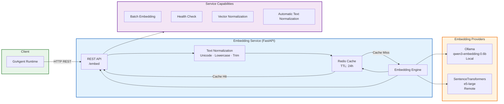
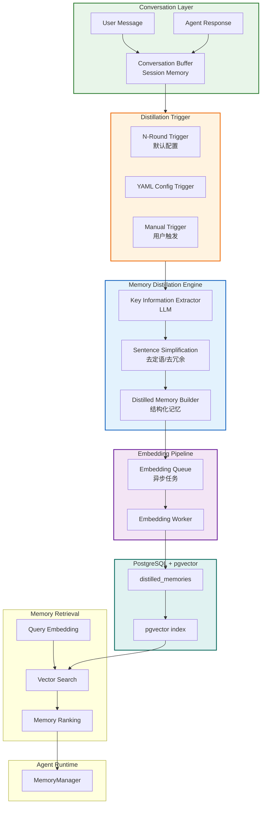

# GoAgent

GoAgent 是一个用 Go 实现的通用 AI Agent 开发框架，支持多 Agent 协作、记忆管理、工具调用等核心功能。

## 架构图

```mermaid
graph TB

%% =======================
%% 用户层
%% =======================

User[用户输入<br/>我想去东京旅行5天<br/>预算10000]


%% =======================
%% Agent Runtime
%% =======================

subgraph AgentRuntime["Agent Runtime"]

    %% Leader
    subgraph LeaderAgent["Leader Agent"]
        MemoryManager[MemoryManager<br/>记忆管理]
        ParseProfile[ParseProfile<br/>LLM解析]
        TaskPlanner[TaskPlanner<br/>LLM任务规划]
        Dispatcher[Dispatcher<br/>errgroup并发]

        MemoryManager --> TaskPlanner
        ParseProfile --> TaskPlanner
        TaskPlanner --> Dispatcher
    end


    %% Sub Agents
    subgraph SubAgents["Sub Agents (并行执行)"]
        DestinationAgent[Destination Agent]
        FoodAgent[Food Agent]
        HotelAgent[Hotel Agent]
        ItineraryAgent[Itinerary Agent]
    end


    %% AHP Protocol
    subgraph AHP["AHP Protocol (Agent 通信)"]

        MessageQueue[In-Memory Message Queue<br/>channel]

        subgraph Queues["Agent Queues"]
            LeaderQueue[leader queue]
            AgentDstQueue[agent_destination]
            AgentFoodQueue[agent_food]
            AgentHotelQueue[agent_hotel]
        end

        MessageQueue --> LeaderQueue
        MessageQueue --> AgentDstQueue
        MessageQueue --> AgentFoodQueue
        MessageQueue --> AgentHotelQueue
    end

end


%% =======================
%% 核心服务
%% =======================

subgraph CoreServices["核心服务"]

    %% LLM
    subgraph LLMSystem["LLM System"]
        OpenAI[OpenAI]
        Ollama[Ollama]
        OpenRouter[OpenRouter]
    end

    %% Tools
    subgraph ToolsSystem["Tools System"]

        subgraph Tools["内置工具"]
            Calculator[calculator]
            DateTime[datetime]
            FileTools[file_tools]
            HTTPRequest[http_request]
            WebScraper[web_scraper]
            KnowledgeSearch[knowledge_search]
        end

    end


    %% Workflow
    subgraph WorkflowEngine["工作流引擎"]

        DAGEngine[DAG 执行引擎<br/>步骤依赖 + 并行控制]

        WorkflowDef[工作流定义<br/>YAML steps<br/>depends_on<br/>variables]

    end


    %% Embedding
    subgraph EmbeddingServer["Embedding 服务"]

        FastAPI[FastAPI 服务]

        subgraph EmbeddingModels["Embedding 模型"]
            OllamaEmbed[Ollama<br/>qwen3-embedding:0.6b]
            SentenceTransformers[e5-large]
        end

        FastAPI --> OllamaEmbed
        FastAPI --> SentenceTransformers

    end

end


%% =======================
%% 存储层
%% =======================

subgraph Storage["存储层 (PostgreSQL + pgvector)"]

    %% Memory Tables
    subgraph MemoryTables["记忆系统"]

        Conversations[conversations<br/>会话记录]

        TaskResults[task_results<br/>任务执行结果]

        DistilledMem[distilled_memories<br/>蒸馏记忆]

    end


    %% Knowledge Base
    subgraph KnowledgeBase["知识库"]

        KnowledgeChunks[knowledge_chunks_1024]

        VectorIndex[向量索引<br/>ivfflat]

        KnowledgeChunks --> VectorIndex

    end


    %% Storage Features
    subgraph StorageFeatures["存储特性"]

        ConnectionPool[连接池<br/>Max 25 / Idle 10]

        TenantIsolation[RLS 租户隔离<br/>SET app.tenant_id]

        WriteBuffer[批量写入缓冲]

        RetrievalGuard[检索限流<br/>100 req/s]

        Timeout[查询超时<br/>30s]

    end

end


%% =======================
%% 连接
%% =======================

User --> LeaderAgent

LeaderAgent --> AHP
AHP --> SubAgents
SubAgents --> AHP

AgentRuntime --> CoreServices

CoreServices --> Storage
EmbeddingServer --> Storage
WorkflowEngine --> Storage


%% =======================
%% 样式
%% =======================

classDef user fill:#e8f5e9,stroke:#2e7d32,stroke-width:2px
classDef runtime fill:#e3f2fd,stroke:#1565c0,stroke-width:2px
classDef services fill:#f3e5f5,stroke:#6a1b9a,stroke-width:2px
classDef storage fill:#e0f2f1,stroke:#00695c,stroke-width:2px

class User user
class AgentRuntime runtime
class CoreServices services
class Storage storage
```


### Embedding Gateway Service (FastAPI)

Embedding Service 是 GoAgent 的独立向量嵌入服务，支持多种后端：




**Embedding Service 特性**:
- **高性能**: 支持 Ollama 本地部署和 SentenceTransformers 云端部署
- **智能缓存**: Redis 缓存 + 文本规范化，避免缓存失效
- **批量处理**: 支持批量向量生成，提升效率
- **自动归一化**: 向量自动归一化为单位向量，确保余弦相似度准确
- **健康检查**: 内置健康检查端点

**配置文件**: `services/embedding/.env`
```env
BACKEND_TYPE=ollama              # 后端类型: ollama / transformers
OLLAMA_BASE_URL=http://localhost:11434
OLLAMA_MODEL=qwen3-embedding:0.6b
MODEL_NAME=qwen3-embedding:0.6b
EMBEDDING_DIM=1024
REDIS_URL=redis://localhost:6379
CACHE_TTL=86400
HOST=0.0.0.0
PORT=8000
```

**代码位置**: 
- `services/embedding/app.py` - 服务主程序
- `services/embedding/config.py` - 配置管理
- `internal/storage/postgres/embedding/client.go` - Go 客户端


### Memory Distillation model




## 技术栈

### 核心技术
- **语言**: Go 1.21+
- **数据库**: PostgreSQL 15+ with pgvector 扩展
- **并发**: errgroup, sync
- **协议**: 自定义 AHP 协议
- **Embedding 服务**: FastAPI + Ollama/SentenceTransformers
- **缓存**: Redis

### 主要组件
| 组件 | 作用 | 实现位置 |
|------|------|----------|
| **Agent 系统** | Leader/Sub Agent 协作 | `internal/agents/` |
| **协议层** | Agent 间通信和心跳 | `internal/protocol/ahp/` |
| **记忆系统** | 会话、任务、蒸馏记忆 | `internal/memory/` |
| **存储层** | PostgreSQL + pgvector | `internal/storage/postgres/` |
| **工具系统** | 工具注册和调用 | `internal/tools/` |
| **工作流引擎** | DAG 工作流编排 | `internal/workflow/engine/` |
| **Embedding 服务** | 向量嵌入生成 | `services/embedding/` |

### 依赖库
- `github.com/lib/pq` - PostgreSQL 驱动
- `github.com/google/uuid` - UUID 生成
- `github.com/stretchr/testify` - 测试框架
- `golang.org/x/sync` - 并发扩展
- `gopkg.in/yaml.v3` - YAML 解析
- `fastapi` - Embedding 服务框架
- `redis` - 缓存支持

## 配置说明

### 1. LLM 配置

**配置文件**: `examples/travel/config.yaml`

```yaml
llm:
  provider: openrouter        # LLM 提供商: openai / ollama / openrouter
  api_key: ""                  # API Key（建议使用环境变量 OPENROUTER_API_KEY）
  base_url: https://openrouter.ai/api/v1
  model: meta-llama/llama-3.1-8b-instruct
  timeout: 60                  # 请求超时时间（秒）
  max_tokens: 2048              # 最大响应 token 数
```

**代码位置**: `internal/llm/client.go:80-100`

### 2. Agent 配置

```yaml
agents:
  leader:
    id: leader-travel
    max_steps: 10              # 最大执行步数
    max_parallel_tasks: 4      # 最大并行任务数
    enable_cache: true          # 启用缓存

  sub:
    - id: agent-destination
      type: destination         # Agent 类型: destination/food/hotel/itinerary
      triggers: [destination]   # 触发关键词
      max_retries: 3             # 最大重试次数
      timeout: 30                # 超时时间（秒）
```

**代码位置**: `internal/agents/leader/agent.go:30-50`

### 3. 数据库配置

```yaml
storage:
  enabled: true               # 启用 PostgreSQL 存储
  type: postgres
  host: localhost
  port: 5433                # Docker 默认端口是 5433
  user: postgres
  password: postgres
  database: goagent
  
  pgvector:
    enabled: true             # 启用 pgvector
    dimension: 1024           # 向量维度
```

**代码位置**: `internal/storage/postgres/pool.go:35-50`

### 4. Embedding 服务配置

```yaml
embedding:
  service_url: http://localhost:8000    # Embedding 服务地址
  model: qwen3-embedding:0.6b          # 模型名称
  dimension: 1024                       # 向量维度
  timeout: 30                           # 请求超时（秒）
```

**代码位置**: `internal/storage/postgres/embedding/client.go:30-50`

### 5. 记忆配置

```yaml
memory:
  enabled: true               # 启用记忆系统
  enable_distillation: true   # 启用记忆蒸馏
  distillation_threshold: 3   # 每 N 轮对话触发一次蒸馏
```

**代码位置**: `examples/knowledge-base/main.go:750-760`

### 6. 检索配置

```yaml
knowledge:
  chunk_size: 1000             # 文档分块大小
  chunk_overlap: 100            # 分块重叠大小
  top_k: 10                    # 返回前 K 个结果
  min_score: 0.6               # 最小相似度阈值
```

**代码位置**: `internal/storage/postgres/repositories/knowledge_repository.go:100-120`

## 快速开始

### 1. 设置环境

```bash
# 设置 API Key（推荐使用环境变量）
export OPENROUTER_API_KEY="your-api-key"

# 或者在配置文件中设置（不推荐）
```

### 2. 启动数据库（可选，用于持久化）

```bash
# 使用 Docker 快速启动 PostgreSQL + pgvector
docker run -d \
  --name goagent-db \
  -e POSTGRES_PASSWORD=postgres \
  -e POSTGRES_DB=goagent \
  -p 5433:5432 \
  pgvector/pgvector:pg15

# 验证连接
docker exec -it goagent-db psql -U postgres -d goagent -c "SELECT version();"
```

### 3. 启动 Embedding 服务（用于向量检索）

```bash
# 进入 embedding 服务目录
cd services/embedding

# 运行设置脚本（安装依赖和模型）
./setup.sh

# 启动服务
./start.sh

# 验证服务
curl http://localhost:8000/health
```

### 4. 运行示例

```bash
# 旅行规划示例
cd examples/travel
go run main.go

# 知识库问答示例（需要数据库 + embedding 服务）
cd examples/knowledge-base
go run main.go --save README.md  # 导入文档
go run main.go --chat             # 开始问答
```

## 项目结构

```
goagent/
├── examples/               # 示例应用
│   ├── travel/              # 旅行规划
│   ├── knowledge-base/       # 知识库问答
│   └── simple/              # 简单示例
├── internal/                # 核心实现
│   ├── agents/              # Agent 系统
│   │   ├── base/            # Agent 基础接口
│   │   ├── leader/          # Leader Agent
│   │   └── sub/             # Sub Agent
│   ├── protocol/             # AHP 协议
│   ├── storage/              # PostgreSQL + pgvector
│   ├── memory/               # 记忆系统
│   └── workflow/             # 工作流引擎
├── services/                # 独立服务
│   └── embedding/           # Embedding 服务
│       ├── app.py           # FastAPI 服务
│       ├── config.py        # 配置管理
│       └── requirements.txt # Python 依赖
├── api/                     # API 层
│   ├── service/             # 服务接口
│   └── client/              # 客户端
└── docs/                    # 文档
```

## 文档

- [快速开始](docs/quick_start.md) - 详细安装和配置指南
- [常见问题](docs/faq.md) - 常见问题和解决方案
- [架构文档](docs/arch.md) - 完整架构设计
- [Embedding 服务文档](services/embedding/README.md) - Embedding 服务详细说明
- [集成指南](docs/integration_guide.md) - 如何集成到现有项目

## 示例

- [旅行规划](examples/travel/) - 多 Agent 协作
- [知识库问答](examples/knowledge-base/) - 向量检索
- [简单示例](examples/simple/) - 基础用法
- [能力演示](examples/capability-demo/) - 完整功能展示

## 开发指南

### 运行测试

```bash
# 运行所有测试
go test ./...

# 运行特定包的测试
go test ./internal/agents/...

# 运行测试并显示覆盖率
go test -cover ./...
```

### 构建项目

```bash
# 构建主程序
go build -o bin/goagent ./cmd/server

# 构建示例
go build -o bin/travel ./examples/travel
```

### 代码规范

```bash
# 格式化代码
go fmt ./...

# 运行 linter
golangci-lint run
```

---

**最后更新**: 2026-03-23  
**适用版本**: v1.0.0  
**代码基准**: 基于 go-agent 实际代码分析