# GoAgent 框架架构设计

**更新日期**: 2026-03-25

## 系统架构总览

```mermaid
graph TB
    %% User Input
    UserInput[User Input<br/>帮我规划一次旅行...] --> LeaderAgent

    %% Leader Agent
    subgraph LeaderAgent["Leader Agent"]
        ParseInput[Parse Input<br/>LLM]
        TaskPlan[Task Plan<br/>LLM]
        Aggregate[Aggregate<br/>Results]
        ParseInput --> TaskPlan
        TaskPlan --> Aggregate
    end

    LeaderAgent -->|dispatch tasks 并行| SubAgents

    %% Sub Agents
    subgraph SubAgents["Sub Agents"]
        AgentDest[Agent-destination<br/>Sub Agent]
        AgentFood[Agent-food<br/>Sub Agent]
        AgentHotel[Agent-hotel<br/>Sub Agent]
    end

    SubAgents --> ProtocolLayer

    %% Protocol Layer
    subgraph ProtocolLayer["Protocol Layer"]
        AHPProtocol[AHP Protocol<br/>Agent Handshake Protocol]
        TASK[TASK]
        RESULT[RESULT]
        PROGRESS[PROGRESS]
        AHPProtocol --> TASK
        AHPProtocol --> RESULT
        AHPProtocol --> PROGRESS
    end

    ProtocolLayer --> CoreServices

    %% Core Services
    subgraph CoreServices["Core Services"]
        %% Tools
        subgraph Tools["Tools System"]
            Calculator[calculator]
            DateTime[datetime]
            HTTPRequest[http_request]
        end

        %% LLM
        subgraph LLM["LLM System"]
            Ollama[Ollama]
            OpenRouter[OpenRouter]
        end

        %% Storage
        subgraph Storage["Storage"]
            PostgreSQL[PostgreSQL + pgvector]
            ConnPool[Connections Pool 25/10]
            VectorIndex[Vector Index ivfflat]
            CosineSearch[Cosine Search]
            PostgreSQL --> ConnPool
            PostgreSQL --> VectorIndex
            PostgreSQL --> CosineSearch
        end
    end

    CoreServices --> MemorySystem

    %% Memory System
    subgraph MemorySystem["Memory System"]
        Session[Session<br/>短期内存]
        UserMemory[User Memory<br/>长期-PG]
        TaskMemory[Task Memory<br/>蒸馏-PG]
        ExperienceSystem[Experience System]
        ProdMgr[ProductionMemoryManager<br/>PG + pgvector 持久化]

        subgraph ExpFlow["Experience Distillation Flow"]
            TaskExec[Task Execution]
            TaskResult[TaskResult]
            Distillation[Distillation]
            Experience[Experience]
            DB[DB]
            Query[Query]
            Retrieval[Retrieval<br/>Vector Search]
            Ranked[Ranked]
            Conflict[Conflict Resolution]

            TaskExec --> TaskResult
            TaskResult --> Distillation
            Distillation --> Experience
            Experience --> DB
            Query --> Retrieval
            Retrieval --> Ranked
            Ranked --> Conflict
        end
    end

    %% Styling
    style LeaderAgent fill:#e1f5ff
    style SubAgents fill:#fff4e1
    style ProtocolLayer fill:#f3e5ff
    style MemorySystem fill:#e8f5e9
    style ExperienceSystem fill:#ffebee
    style ExpFlow fill:#fce4ec
```

**代码位置**:
- Leader Agent: `internal/agents/leader/agent.go`
- Sub Agent: `internal/agents/sub/agent.go`
- Protocol: `internal/protocol/ahp/`
- LLM Client: `internal/llm/client.go`
- Storage Pool: `internal/storage/postgres/pool.go`
- Memory Manager: `internal/memory/production_manager.go`
- Experience Distillation: `api/experience/`
- Experience Repository: `internal/storage/postgres/repositories/`

---

## 消息流转机制

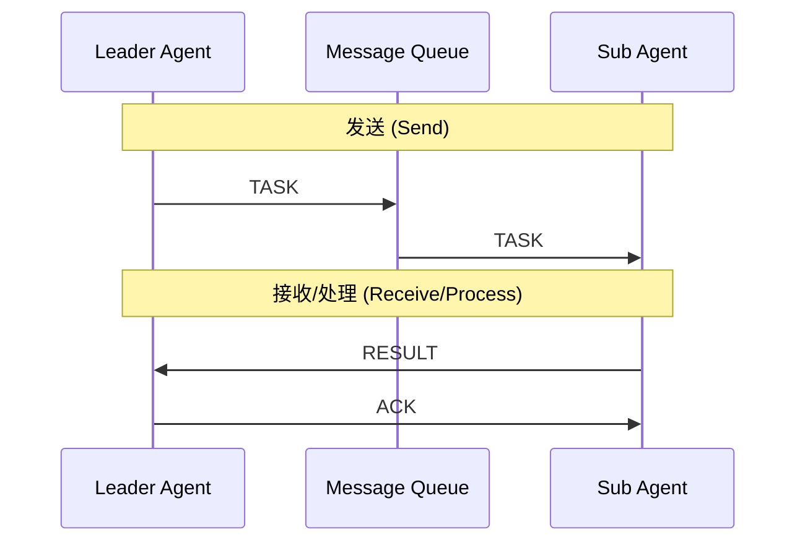

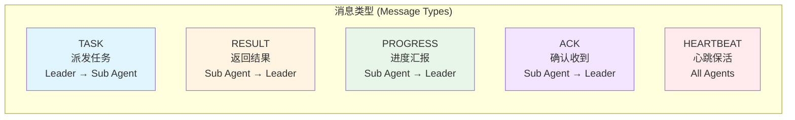

---

## 任务生产消费流程

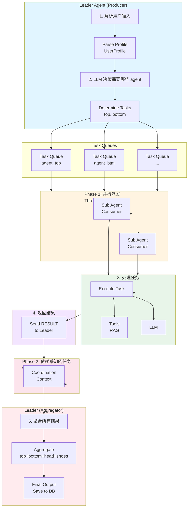

---

## Actor 模型对应关系

| Actor 模型概念 | go-agent 实现 |
|----------------|-----------|
| Actor | `LeaderAgent`, `OutfitSubAgent` |
| Mailbox | `MessageQueue` (In-Memory) |
| Message | `AHPMessage` (TASK/RESULT/PROGRESS/ACK) |
| Behavior | Agent 内部的 `_handle_task()`, `_recommend()` |
| Supervisor | `LeaderAgent` 协调多个 Sub Agent |
| Failure Handling | DLQ (Dead Letter Queue) |

---

## 关键设计点

| 特性 | 实现方式 |
|------|----------|
| **并发模型** | Worker Pool 派发任务到多个 Sub Agent |
| **通信协议** | In-Memory Message Queue + AHP 自定义协议 |
| **状态管理** | SessionMemory 短期会话 + TaskMemory 蒸馏 |
| **容错机制** | DLQ 存储失败消息，支持重试 |
| **任务协调** | Phase 1 (并行) → Phase 2 (依赖感知) |
| **扩展性** | 可动态注册新的 Agent 类型 |
| **Agent 定义** | Markdown 文件配置，支持热加载 |
| **工作流编排** | YAML/JSON DSL，用户自定义流程 |
| **LLM 输出** | 四层保障机制确保输出一致性 |

---

## Agent 定义 (Markdown 配置)

Agent 采用 Markdown 文件定义，允许非开发人员通过编辑配置文件调整 Agent 行为。

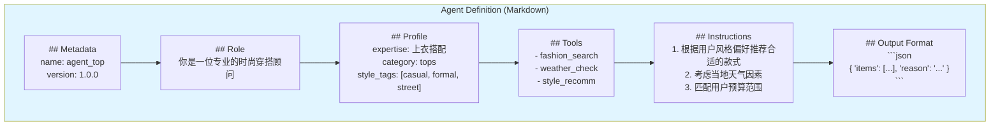

### 内置变量

| 变量 | 说明 |
|------|------|
| {{.UserProfile}} | 用户画像 |
| {{.SessionID}} | 会话 ID |
| {{.Context}} | 上下文信息 |
| {{.Input}} | 用户输入 |
| {{.Results}} | 上游结果 |

---

## Workflow Engine (工作流编排)

用户可以通过 YAML/JSON 文件自定义工作流，实现灵活的 Agent 编排。

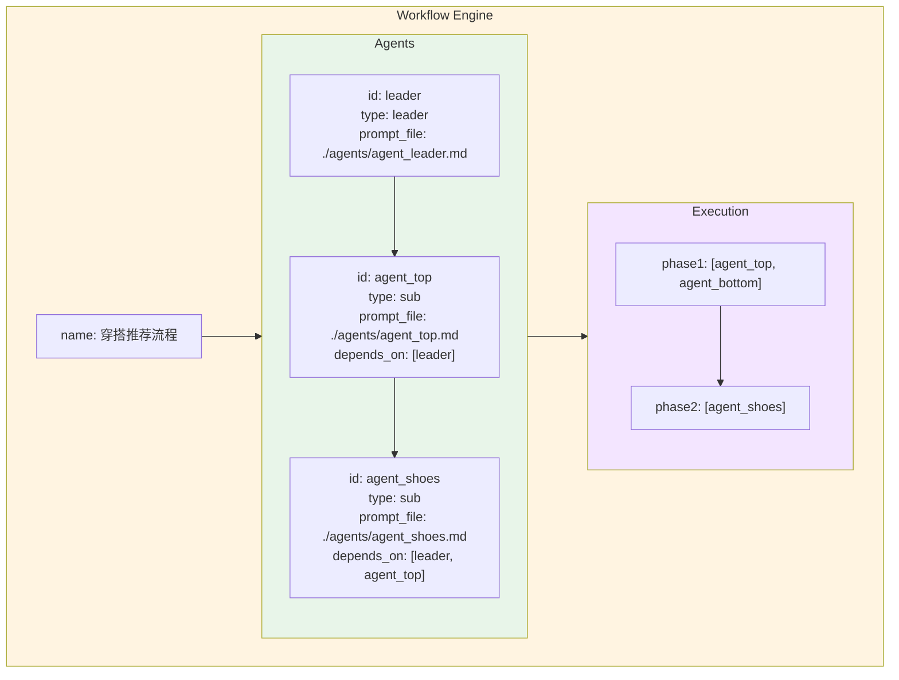

### 目录结构

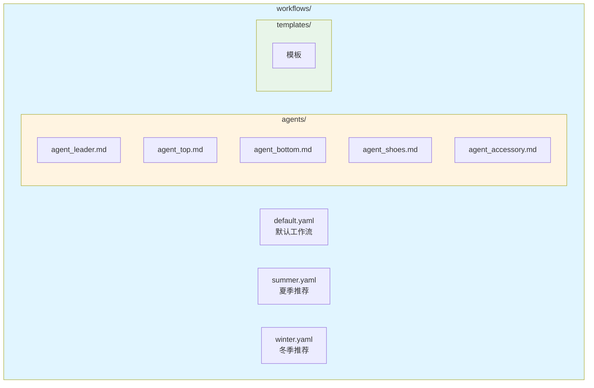

---

## LLM Output 标准化

多 LLM 输出通过四层保障机制确保一致性。

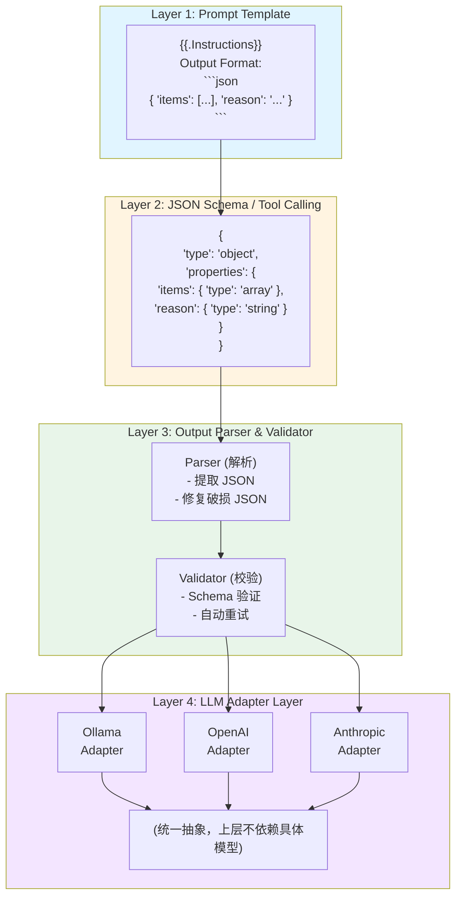

### 完整调用流程

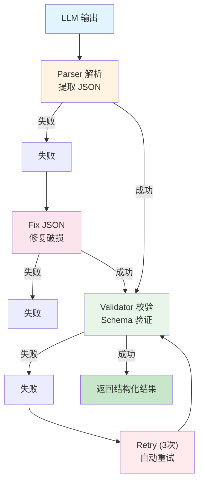

---

## 目录结构

```
goagent/
├── internal/                # 核心实现
│   ├── agents/              # Agent 系统
│   │   ├── base/            # Agent 基础接口
│   │   ├── leader/          # Leader Agent
│   │   └── sub/             # Sub Agent
│   ├── protocol/            # AHP 协议
│   │   └── ahp/             # 协议实现
│   ├── storage/             # 存储层
│   │   └── postgres/        # PostgreSQL + pgvector
│   │       ├── pool.go      # 连接池
│   │       ├── repositories/ # 数据仓库
│   │       └── migrations/   # 数据库迁移
│   ├── memory/              # 记忆系统
│   │   └── production_manager.go
│   ├── llm/                 # LLM 客户端
│   │   └── client.go
│   ├── tools/               # 工具系统
│   │   └── resources/
│   ├── core/                # 核心类型
│   │   ├── errors/          # 错误定义
│   │   └── types.go
│   ├── config/              # 配置管理
│   ├── workflow/            # 工作流引擎
│   ├── ratelimit/           # 限流
│   ├── shutdown/            # 优雅退出
│   └── observability/       # 可观测性
├── api/                     # API 层
│   ├── service/             # 服务接口
│   │   ├── agent/           # Agent 服务
│   │   ├── llm/             # LLM 服务
│   │   ├── memory/          # 记忆服务
│   │   └── retrieval/       # 检索服务
│   └── client/              # 客户端
├── examples/                # 示例应用
│   ├── travel/              # 旅行规划
│   ├── knowledge-base/      # 知识库问答
│   ├── simple/              # 简单示例
│   └── capability-demo/     # 功能演示
├── services/                # 独立服务
│   └── embedding/           # Embedding 服务
│       ├── app.py           # FastAPI 服务
│       └── config.py
├── cmd/                     # 命令行工具
│   └── server/              # 服务器启动
├── docs/                    # 文档
└── configs/                 # 配置文件
```

**代码位置**: 项目根目录

---

## 技术栈

| 层级 | 技术选型 | 代码位置 |
|------|----------|----------|
| 语言 | Go 1.21+ | - |
| LLM | Ollama / OpenRouter | `internal/llm/client.go` |
| 协议 | AHP (Agent Handshake Protocol) | `internal/protocol/ahp/` |
| 存储 | PostgreSQL 15+ with pgvector | `internal/storage/postgres/` |
| 并发 | errgroup, sync | - |
| 工具 | 内置工具 | `internal/tools/` |
| Embedding | FastAPI + Ollama/SentenceTransformers | `services/embedding/` |

---

## 消息格式 (AHP Protocol)

**代码位置**: `internal/protocol/ahp/message.go`

```go
type Message struct {
    MessageID  string    `json:"message_id"`
    Method     Method    `json:"method"`     // TASK, RESULT, PROGRESS, ACK
    AgentID    string    `json:"agent_id"`
    TargetID   string    `json:"target_id"`
    TaskID     string    `json:"task_id"`
    SessionID  string    `json:"session_id"`
    Payload    []byte    `json:"payload"`
    Timestamp  time.Time `json:"timestamp"`
}

type Method string

const (
    MethodTask     Method = "TASK"
    MethodResult   Method = "RESULT"
    MethodProgress Method = "PROGRESS"
    MethodAck      Method = "ACK"
)
```

---

## 错误码体系

### 错误码规范

```
格式: XX-YYY-ZZZ
  - XX:   模块代码 (01-Agent, 02-Protocol, 03-Storage, 04-LLM, 05-Tools)
  - YYY:  错误类型 (001-099 系统级, 100-199 业务级)
  - ZZZ:  具体错误序号
```

### 错误码表

| 错误码 | 名称 | 说明 | 可重试 | 最大重试次数 |
|--------|------|------|--------|--------------|
| **01-Agent** |
| 01-001 | AgentNotFound | Agent 未注册 | 否 | 0 |
| 01-002 | AgentTimeout | Agent 执行超时 | 是 | 3 |
| 01-003 | AgentPanic | Agent 内部 panic | 是 | 2 |
| 01-004 | TaskQueueFull | 任务队列满 | 是 | 5 |
| 01-005 | DependencyCycle | 任务依赖循环 | 否 | 0 |
| **02-Protocol** |
| 02-001 | InvalidMessage | 消息格式错误 | 否 | 0 |
| 02-002 | MessageTimeout | 消息发送超时 | 是 | 3 |
| 02-003 | HeartbeatMissed | 心跳丢失 | 是 | 5 |
| **03-Storage** |
| 03-001 | DBConnectionFailed | 数据库连接失败 | 是 | 3 |
| 03-002 | QueryFailed | 查询失败 | 是 | 2 |
| 03-003 | VectorSearchFailed | 向量搜索失败 | 是 | 2 |
| **04-LLM** |
| 04-001 | LLMRequestFailed | LLM 请求失败 | 是 | 3 |
| 04-002 | LLMTimeout | LLM 响应超时 | 是 | 2 |
| 04-003 | LLMQuotaExceeded | 配额超限 | 否 | 0 |

### 统一错误处理

```go
type ErrorCode struct {
    Code       string                 `json:"code"`
    Message    string                 `json:"message"`
    Module     string                 `json:"module"`
    Retry      bool                   `json:"retry"`
    RetryMax   int                    `json:"retry_max"`
    Backoff    time.Duration          `json:"backoff"`
}

type AppError struct {
    Code    ErrorCode
    Err     error
    Stack   string
    Context map[string]interface{}
}
```

---

## 优雅 Shutdown 流程

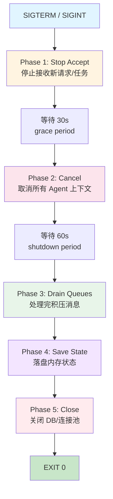

### Shutdown 阶段状态

| 阶段 | 状态码 | 说明 |
|------|--------|------|
| Running | 0 | 正常运行 |
| Stopping | 1 | 停止接收新请求 |
| Draining | 2 | 处理积压任务 |
| Exiting | 3 | 清理退出 |

### 实现要点

- **Grace Period**: 30秒，允许新请求完成当前处理
- **Shutdown Period**: 60秒，等待队列清空
- **Force Timeout**: 超过总时间后强制退出
- **Signal 捕获**: 同时支持 SIGTERM（推荐）和 SIGINT

---

## 限流与背压机制

### 限流策略

| 场景 | 限流方式 | 阈值 |
|------|----------|------|
| Agent 并发数 | 信号量 (Semaphore) | 每 Agent 最大 10 并发 |
| 任务队列 | 队列长度限制 | 单队列最大 1000 条 |
| LLM 请求 | 令牌桶 (Token Bucket) | 每秒 10 请求 |
| 全局 QPS | 滑动窗口 | 系统最大 100 QPS |

---

## 数据库连接池设计

采用"谁用谁连接，用完释放"的原则，避免长时间占用数据库连接资源。

### 传统模式 vs 连接池模式

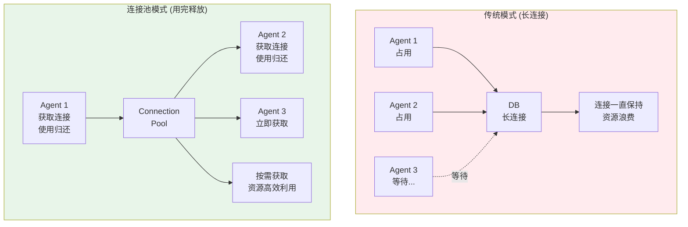

### 连接池设计

```go
// 连接池管理器
type ConnectionPool struct {
    maxOpen    int           // 最大打开连接数
    maxIdle    int           // 最大空闲连接数
    maxLifetime time.Duration // 连接最大生命周期
    
    mu         sync.Mutex
    openCount  int           // 当前打开的连接数
    idleCount  int           // 当前空闲的连接数
    connections chan *DBConn  // 连接池队列
}

// 获取连接
func (p *ConnectionPool) Get(ctx context.Context) (*DBConn, error) {
    select {
    case conn := <-p.connections:
        // 从池中获取空闲连接
        if conn.IsValid() {
            return conn, nil
        }
        // 连接已过期，重新创建
        return p.createConn()
        
    case <-ctx.Done():
        return nil, ctx.Err()
        
    default:
        // 池中没有空闲连接
        if p.openCount >= p.maxOpen {
            // 达到最大连接数，等待
            return p.waitForConnection(ctx)
        }
        // 创建新连接
        return p.createConn()
    }
}

// 归还连接
func (p *ConnectionPool) Put(conn *DBConn) error {
    if !conn.IsValid() {
        // 连接已失效，关闭
        conn.Close()
        p.mu.Lock()
        p.openCount--
        p.mu.Unlock()
        return nil
    }
    
    // 放回池中
    select {
    case p.connections <- conn:
        return nil
    default:
        // 池已满，关闭连接
        conn.Close()
        p.mu.Lock()
        p.openCount--
        p.mu.Unlock()
        return nil
    }
}
```

### Agent 使用模式

```go
// Agent 中使用连接池
func (a *SubAgent) ExecuteTask(ctx context.Context, task *Task) (*TaskResult, error) {
    // 从池中获取连接
    conn, err := pool.Get(ctx)
    if err != nil {
        return nil, err
    }
    defer pool.Put(conn)  // 用完归还
    
    // 使用连接执行操作
    result, err := a.doQuery(ctx, conn, task)
    if err != nil {
        return nil, err
    }
    
    return result, nil
}
```

### 连接池配置

| 参数 | 默认值 | 说明 |
|------|--------|------|
| max_open | 25 | 最大打开连接数 |
| max_idle | 10 | 最大空闲连接数 |
| conn_max_lifetime | 5m | 连接最大生命周期 |
| conn_max_idle_time | 1m | 空闲连接最大存活时间 |
| max_wait_time | 30s | 获取连接最大等待时间 |

### 监控指标

| 指标 | 说明 | 告警阈值 |
|------|------|----------|
| db_open_connections | 当前打开的连接数 | > 20 |
| db_idle_connections | 当前空闲的连接数 | < 2 |
| db_wait_count | 等待连接次数 | > 100 |
| db_wait_duration | 等待连接总时长 | > 1s |

### 背压机制

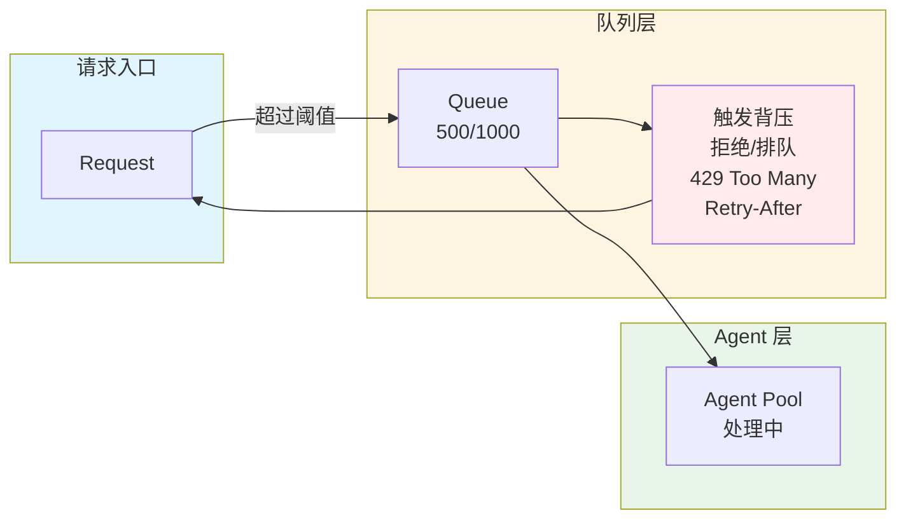

**背压策略:**
1. 队列 80% → 告警通知
2. 队列 90% → 拒绝新任务 (429)
3. 队列 100% → 触发 DLQ

### 实现方案

```go
// 令牌桶限流
type TokenBucket struct {
    rate       float64       // 每秒令牌数
    capacity   int           // 桶容量
    tokens     float64
    lastUpdate time.Time
    mu         sync.Mutex
}

// 背压控制
type Backpressure struct {
    queueLimit    int           // 队列上限
    currentLoad   atomic.Int32   // 当前负载
    rejectionRate float64       // 拒绝率阈值
    
    // 响应头
    RetryAfter   time.Duration  // 建议重试时间
    RetryCount   int            // 已重试次数
}

// 限流策略选择
var LimiterStrategy = map[string]Limiter{
    "llm":    NewTokenBucket(10, 50),   // LLM 请求
    "agent":  NewSemaphore(10),          // Agent 并发
    "global": NewSlidingWindow(100),    // 全局 QPS
}
```

### 监控指标

| 指标 | 说明 | 告警阈值 |
|------|------|----------|
| queue_depth | 队列深度 | > 800 |
| rejection_rate | 拒绝率 | > 5% |
| latency_p99 | 延迟 P99 | > 5s |
| active_agents | 活跃 Agent 数 | < 50% 利用率 |

---

## 生产环境补充建议

### 可观测性

- **日志**: 结构化 JSON 日志，分级输出 (DEBUG/INFO/WARN/ERROR)
- **指标**: Prometheus + Grafana 面板
- **链路**: OpenTelemetry 分布式追踪

### 扩展性预留

- 消息队列支持 Redis Stream 替换
- 存储层支持多数据源切换
- Agent 支持动态注册与发现

---

