# GoAgent Architecture Design

**Last Updated**: 2026-03-24

## System Architecture Overview

```mermaid
graph TB
    %% User Input
    UserInput[User Input<br/>Help me plan a trip...] --> LeaderAgent

    %% Leader Agent
    subgraph LeaderAgent["Leader Agent"]
        ParseInput[Parse Input<br/>LLM]
        TaskPlan[Task Plan<br/>LLM]
        Aggregate[Aggregate<br/>Results]
        ParseInput --> TaskPlan
        TaskPlan --> Aggregate
    end

    LeaderAgent -->|dispatch tasks parallel| SubAgents

    %% Sub Agents
    subgraph SubAgents["Sub Agents"]
        AgentDest[Agent-destination<br/>Sub Agent]
        AgentFood[Agent-food<br/>Sub Agent]
        AgentHotel[Agent-hotel<br/>Sub Agent]
    end

    SubAgents --> ProtocolLayer

    %% Protocol Layer
    subgraph ProtocolLayer["Protocol Layer"]
        AHPProtocol[AHP Protocol<br/>Agent Handshake Protocol]
        TASK[TASK]
        RESULT[RESULT]
        PROGRESS[PROGRESS]
        AHPProtocol --> TASK
        AHPProtocol --> RESULT
        AHPProtocol --> PROGRESS
    end

    ProtocolLayer --> CoreServices

    %% Core Services
    subgraph CoreServices["Core Services"]
        %% Tools
        subgraph Tools["Tools System"]
            Calculator[calculator]
            DateTime[datetime]
            HTTPRequest[http_request]
        end

        %% LLM
        subgraph LLM["LLM System"]
            Ollama[Ollama]
            OpenRouter[OpenRouter]
        end

        %% Storage
        subgraph Storage["Storage"]
            PostgreSQL[PostgreSQL + pgvector]
            ConnPool[Connections Pool 25/10]
            VectorIndex[Vector Index ivfflat]
            CosineSearch[Cosine Search]
            PostgreSQL --> ConnPool
            PostgreSQL --> VectorIndex
            PostgreSQL --> CosineSearch
        end
    end

    CoreServices --> MemorySystem

    %% Memory System
    subgraph MemorySystem["Memory System"]
        Session[Session<br/>Short-term]
        UserMemory[User Memory<br/>Long-term]
        TaskMemory[Task Memory<br/>Distilled]
        ExperienceSystem[Experience System]
        ProdMgr[ProductionMemoryManager<br/>PG + pgvector persistence]

        subgraph ExpFlow["Experience Distillation Flow"]
            TaskExec[Task Execution]
            TaskResult[TaskResult]
            Distillation[Distillation]
            Experience[Experience]
            DB[DB]
            Query[Query]
            Retrieval[Retrieval<br/>Vector Search]
            Ranked[Ranked]
            Conflict[Conflict Resolution]

            TaskExec --> TaskResult
            TaskResult --> Distillation
            Distillation --> Experience
            Experience --> DB
            Query --> Retrieval
            Retrieval --> Ranked
            Ranked --> Conflict
        end
    end

    %% Styling
    style LeaderAgent fill:#e1f5ff
    style SubAgents fill:#fff4e1
    style ProtocolLayer fill:#f3e5ff
    style MemorySystem fill:#e8f5e9
    style ExperienceSystem fill:#ffebee
    style ExpFlow fill:#fce4ec
```

**Code Locations**:
- Leader Agent: `internal/agents/leader/agent.go`
- Sub Agent: `internal/agents/sub/agent.go`
- Protocol: `internal/protocol/ahp/`
- LLM Client: `internal/llm/client.go`
- Storage Pool: `internal/storage/postgres/pool.go`
- Memory Manager: `internal/memory/production_manager.go`
- Experience Distillation: `api/experience/`
- Experience Repository: `internal/storage/postgres/repositories/`

---

## Core Component Implementation

### Leader Agent

Leader Agent is responsible for task decomposition, distribution, and result aggregation.

**Code Location**: `internal/agents/leader/agent.go`

```go
type LeaderAgent struct {
    id               string
    maxSteps         int
    maxParallelTasks int
    subAgents        map[string]*SubAgent
    llmClient        *llm.Client
}

func (l *LeaderAgent) Process(ctx context.Context, input string) (string, error) {
    // 1. Parse user input
    parsed, err := l.parseInput(ctx, input)
    if err != nil {
        return "", err
    }

    // 2. Generate task plan
    tasks, err := l.planTasks(ctx, parsed)
    if err != nil {
        return "", err
    }

    // 3. Execute tasks in parallel
    results, err := l.executeTasks(ctx, tasks)
    if err != nil {
        return "", err
    }

    // 4. Aggregate results
    return l.aggregateResults(ctx, results)
}
```

### Sub Agent

Sub Agent is responsible for executing specific tasks.

**Code Location**: `internal/agents/sub/agent.go`

```go
type SubAgent struct {
    id        string
    agentType string
    triggers  []string
    llmClient *llm.Client
    tools     []Tool
}

func (s *SubAgent) Execute(ctx context.Context, task *Task) (*TaskResult, error) {
    // 1. Check trigger conditions
    if !s.shouldExecute(task) {
        return nil, nil
    }

    // 2. Execute tools
    toolResults, err := s.executeTools(ctx, task)
    if err != nil {
        return nil, err
    }

    // 3. LLM generates response
    response, err := s.llmClient.Generate(ctx, s.buildPrompt(task, toolResults))
    if err != nil {
        return nil, err
    }

    return &TaskResult{
        AgentID: s.id,
        Result:  response,
    }, nil
}
```

### LLM Client

Unified client supporting multiple LLM providers.

**Code Location**: `internal/llm/client.go`

```go
type Client struct {
    config     *Config
    httpClient *http.Client
}

func (c *Client) Generate(ctx context.Context, prompt string) (string, error) {
    switch ProviderType(c.config.Provider) {
    case ProviderOpenRouter:
        return c.generateOpenRouter(ctx, prompt)
    case ProviderOllama:
        return c.generateOllama(ctx, prompt)
    default:
        return "", fmt.Errorf("unsupported provider: %s", c.config.Provider)
    }
}
```

### Storage Pool

PostgreSQL connection pool implementing "Get-Use-Release" pattern.

**Code Location**: `internal/storage/postgres/pool.go`

```go
type Pool struct {
    cfg          *Config
    db           *sql.DB
    mu           sync.RWMutex
    openCount    int
    idleCount    int
    waitCount    int
    waitDuration time.Duration
}

func (p *Pool) WithConnection(ctx context.Context, fn func(*sql.Conn) error) error {
    conn, err := p.Get(ctx)
    if err != nil {
        return err
    }
    defer p.Release(conn)

    return fn(conn)
}
```

---

## Tech Stack

| Layer | Tech Stack | Code Location |
|-------|-----------|---------------|
| Language | Go 1.21+ | - |
| LLM | Ollama / OpenRouter | `internal/llm/client.go` |
| Protocol | AHP (Agent Handshake Protocol) | `internal/protocol/ahp/` |
| Storage | PostgreSQL 15+ with pgvector | `internal/storage/postgres/` |
| Concurrency | errgroup, sync | - |
| Tools | Built-in tools | `internal/tools/` |
| Embedding | FastAPI + Ollama/SentenceTransformers | `services/embedding/` |

---

## Message Format (AHP Protocol)

**Code Location**: `internal/protocol/ahp/message.go`

```go
type Message struct {
    MessageID  string    `json:"message_id"`
    Method     Method    `json:"method"`     // TASK, RESULT, PROGRESS, ACK
    AgentID    string    `json:"agent_id"`
    TargetID   string    `json:"target_id"`
    TaskID     string    `json:"task_id"`
    SessionID  string    `json:"session_id"`
    Payload    []byte    `json:"payload"`
    Timestamp  time.Time `json:"timestamp"`
}

type Method string

const (
    MethodTask     Method = "TASK"
    MethodResult   Method = "RESULT"
    MethodProgress Method = "PROGRESS"
    MethodAck      Method = "ACK"
)
```

---

## Directory Structure

```
goagent/
├── internal/                # Core implementation
│   ├── agents/              # Agent system
│   │   ├── base/            # Agent base interfaces
│   │   ├── leader/          # Leader Agent
│   │   └── sub/             # Sub Agent
│   ├── protocol/            # AHP protocol
│   │   └── ahp/             # Protocol implementation
│   ├── storage/             # Storage layer
│   │   └── postgres/        # PostgreSQL + pgvector
│   │       ├── pool.go      # Connection pool
│   │       ├── repositories/ # Data repositories
│   │       └── migrations/   # Database migrations
│   ├── memory/              # Memory system
│   │   └── production_manager.go
│   ├── llm/                 # LLM client
│   │   └── client.go
│   ├── tools/               # Tool system
│   │   └── resources/
│   ├── core/                # Core types
│   │   ├── errors/          # Error definitions
│   │   └── types.go
│   ├── config/              # Configuration management
│   ├── workflow/            # Workflow engine
│   ├── ratelimit/           # Rate limiting
│   ├── shutdown/            # Graceful shutdown
│   └── observability/       # Observability
├── api/                     # API layer
│   ├── service/             # Service interfaces
│   │   ├── agent/           # Agent service
│   │   ├── llm/             # LLM service
│   │   ├── memory/          # Memory service
│   │   └── retrieval/       # Retrieval service
│   └── client/              # Client
├── examples/                # Example applications
│   ├── travel/              # Travel planning
│   ├── knowledge-base/      # Knowledge base Q&A
│   ├── simple/              # Simple example
│   └── capability-demo/     # Feature demonstration
├── services/                # Standalone services
│   └── embedding/           # Embedding service
│       ├── app.py           # FastAPI service
│       └── config.py
├── cmd/                     # Command line tools
│   └── server/              # Server startup
├── docs/                    # Documentation
└── configs/                 # Configuration files
```

**Code Location**: Project root directory

---

## Key Design Points

| Feature | Implementation |
|---------|----------------|
| **Concurrency Model** | Worker pool dispatches tasks to multiple Sub Agents |
| **Communication Protocol** | In-Memory Message Queue + AHP custom protocol |
| **State Management** | SessionMemory short-term + TaskMemory distillation |
| **Fault Tolerance** | DLQ stores failed messages, supports retry |
| **Task Coordination** | Phase 1 (parallel) → Phase 2 (dependency-aware) |
| **Scalability** | Dynamic registration of new Agent types |
| **Agent Definition** | Markdown file configuration, supports hot reload |
| **Workflow Orchestration** | YAML/JSON DSL, user-defined workflows |
| **LLM Output** | Four-layer guarantee mechanism ensures output consistency |

---

## Agent Definition (Markdown Configuration)

Agents are defined using Markdown files, allowing non-developers to adjust Agent behavior by editing configuration files.

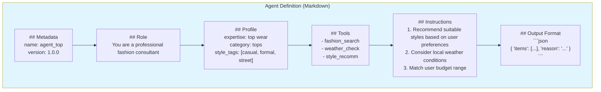

### Built-in Variables

| Variable | Description |
|----------|-------------|
| {{.UserProfile}} | User profile |
| {{.SessionID}} | Session ID |
| {{.Context}} | Context information |
| {{.Input}} | User input |
| {{.Results}} | Upstream results |

---

## Workflow Engine (Workflow Orchestration)

Users can customize workflows through YAML/JSON files to achieve flexible Agent orchestration.

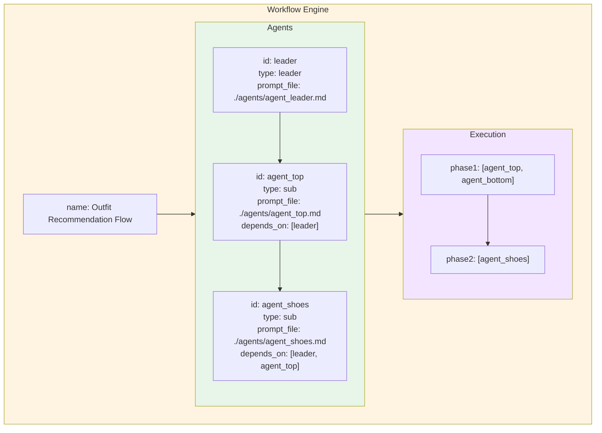

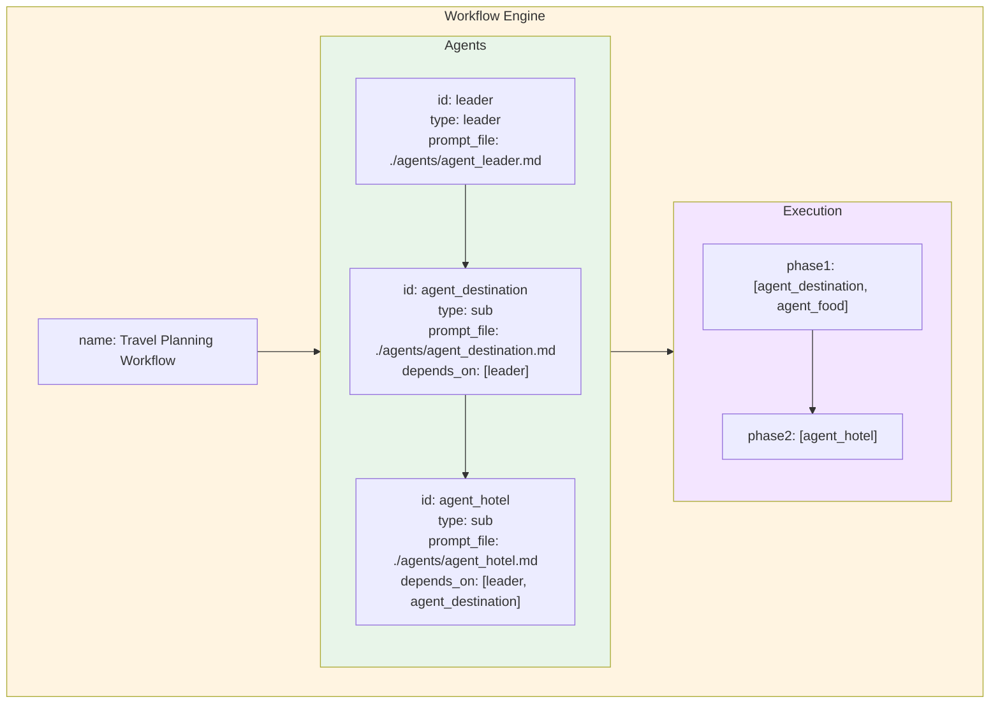

### Directory Structure

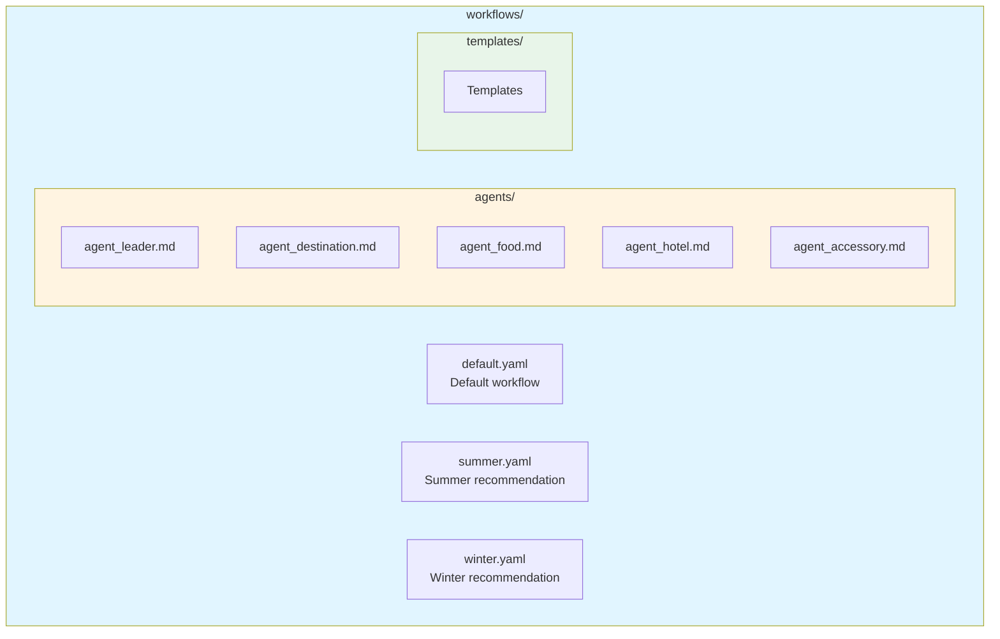

---

## LLM Output Standardization

Multi-LLM output is ensured through a four-layer guarantee mechanism.

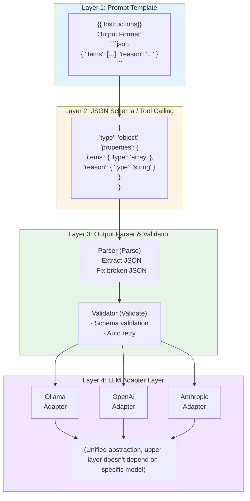

### Complete Call Flow

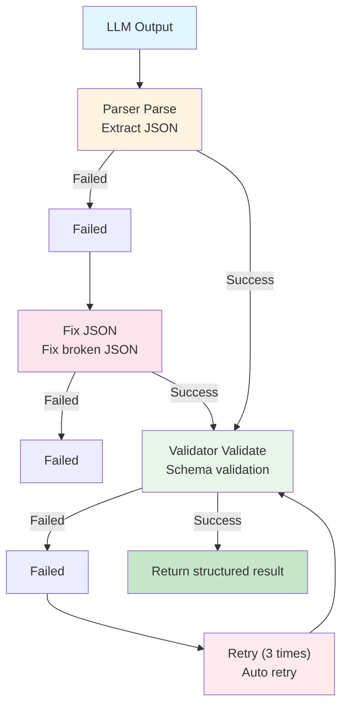

---

## Message Flow Mechanism

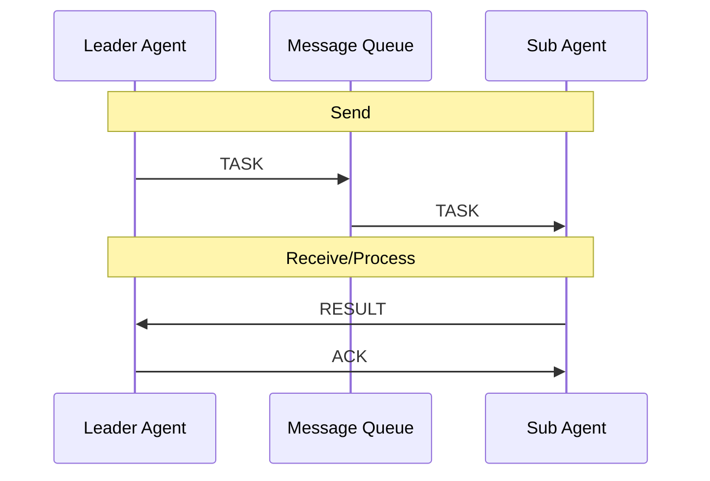

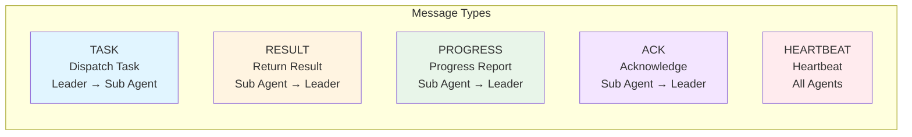

---

## Task Production-Consumption Flow

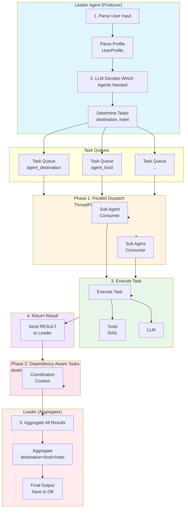

---

## Actor Model Mapping

| Actor Model Concept |  Implementation |
|---------------------|----------------------|
| Actor | `LeaderAgent`, `OutfitSubAgent` |
| Mailbox | `MessageQueue` (In-Memory) |
| Message | `AHPMessage` (TASK/RESULT/PROGRESS/ACK) |
| Behavior | Agent internal `_handle_task()`, `_recommend()` |
| Supervisor | `LeaderAgent` coordinates multiple Sub Agents |
| Failure Handling | DLQ (Dead Letter Queue) |

---

## Error Code System

### Error Code Specification

```
Format: XX-YYY-ZZZ
  - XX:   Module code (01-Agent, 02-Protocol, 03-Storage, 04-LLM, 05-Tools)
  - YYY:  Error type (001-099 system level, 100-199 business level)
  - ZZZ:  Specific error sequence number
```

### Error Code Table

| Error Code | Name | Description | Retriable | Max Retries |
|------------|------|-------------|-----------|-------------|
| **01-Agent** |
| 01-001 | AgentNotFound | Agent not registered | No | 0 |
| 01-002 | AgentTimeout | Agent execution timeout | Yes | 3 |
| 01-003 | AgentPanic | Agent internal panic | Yes | 2 |
| 01-004 | TaskQueueFull | Task queue full | Yes | 5 |
| 01-005 | DependencyCycle | Task dependency cycle | No | 0 |
| **02-Protocol** |
| 02-001 | InvalidMessage | Invalid message format | No | 0 |
| 02-002 | MessageTimeout | Message send timeout | Yes | 3 |
| 02-003 | HeartbeatMissed | Heartbeat missed | Yes | 5 |
| **03-Storage** |
| 03-001 | DBConnectionFailed | Database connection failed | Yes | 3 |
| 03-002 | QueryFailed | Query failed | Yes | 2 |
| 03-003 | VectorSearchFailed | Vector search failed | Yes | 2 |
| **04-LLM** |
| 04-001 | LLMRequestFailed | LLM request failed | Yes | 3 |
| 04-002 | LLMTimeout | LLM response timeout | Yes | 2 |
| 04-003 | LLMQuotaExceeded | Quota exceeded | No | 0 |

### Unified Error Handling

```go
type ErrorCode struct {
    Code       string                 `json:"code"`
    Message    string                 `json:"message"`
    Module     string                 `json:"module"`
    Retry      bool                   `json:"retry"`
    RetryMax   int                    `json:"retry_max"`
    Backoff    time.Duration          `json:"backoff"`
}

type AppError struct {
    Code    ErrorCode
    Err     error
    Stack   string
    Context map[string]interface{}
}
```

---

## Graceful Shutdown Flow

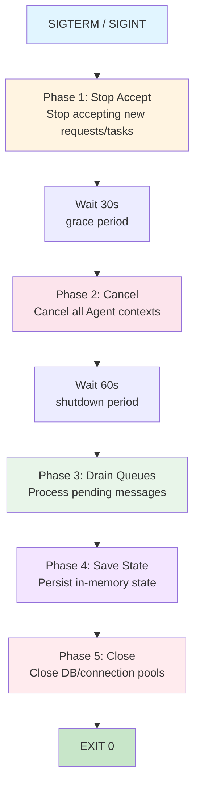

---

## Rate Limiting & Backpressure Mechanism

### Rate Limiting Strategy

| Scenario | Rate Limiting Method | Threshold |
|----------|---------------------|-----------|
| Agent Concurrency | Semaphore | Max 10 concurrent per Agent |
| Task Queue | Queue length limit | Max 1000 items per queue |
| LLM Requests | Token Bucket | 10 requests per second |
| Global QPS | Sliding Window | System max 100 QPS |

---

## Database Connection Pool Design

Adopting "get-use-release" principle to avoid long-term occupation of database connection resources.

### Traditional Mode vs Connection Pool Mode

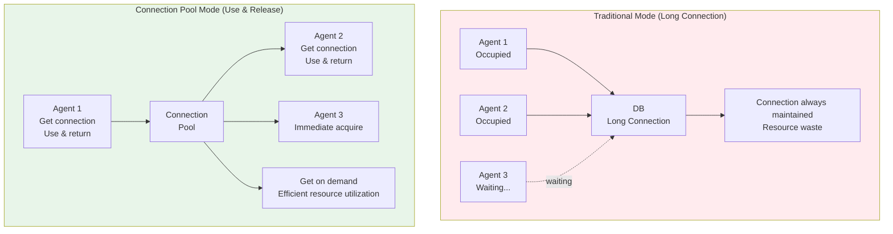

### Connection Pool Configuration

| Parameter | Default Value | Description |
|-----------|---------------|-------------|
| max_open | 25 | Maximum open connections |
| max_idle | 10 | Maximum idle connections |
| conn_max_lifetime | 5m | Connection maximum lifetime |
| conn_max_idle_time | 1m | Idle connection maximum survival time |
| max_wait_time | 30s | Maximum wait time to get connection |

### Monitoring Metrics

| Metric | Description | Alert Threshold |
|--------|-------------|-----------------|
| db_open_connections | Current open connections | > 20 |
| db_idle_connections | Current idle connections | < 2 |
| db_wait_count | Wait connection count | > 100 |
| db_wait_duration | Total wait duration | > 1s |

### Backpressure Mechanism

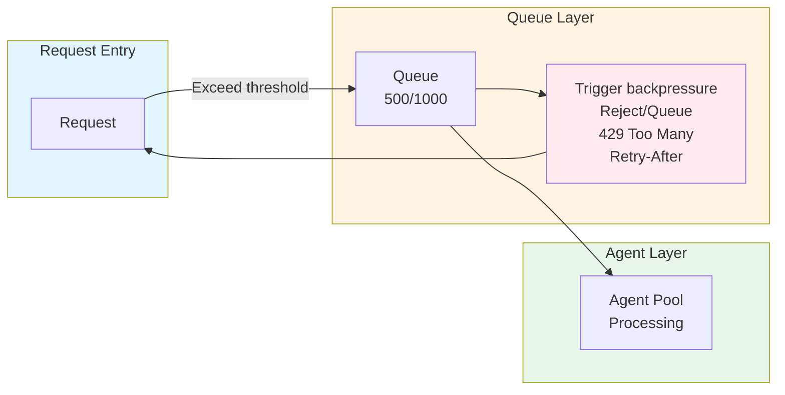

**Backpressure Strategy:**
1. Queue 80% → Alert notification
2. Queue 90% → Reject new tasks (429)
3. Queue 100% → Trigger DLQ

---

## Production Environment Recommendations

### Observability

- **Logging**: Structured JSON logging, hierarchical output (DEBUG/INFO/WARN/ERROR)
- **Metrics**: Prometheus + Grafana dashboards
- **Tracing**: Distributed tracing for request flow
- **Alerting**: Multi-level alerting strategy

### Scalability Reservations

- Horizontal scaling support for Agent instances
- Database read-write separation
- Cache layer (Redis) for hot data
- CDN acceleration for static resources

---

**Version**: 1.0  
**Last Updated**: 2026-03-25  
**Maintainer**: GoAgent Team